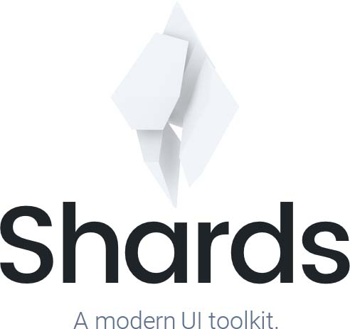

<p align="center">

</p>

<p align="center">
A modern UI kit packed with 2 custom page templates and 11 extra <br />custom components built on top of Bootstrap (4.3.1).
</p>

<br />

<p align="center">
  <a href="https://www.npmjs.com/package/shards-ui">
    
  </a>
  <a href="https://www.npmjs.com/package/shards-ui">
    
  </a>
  <a href="#">
    
  </a>
  <a href="#">
    
  </a>
  <a href="https://twitter.com/intent/tweet?url=https://designrevision.com/downloads/shards&text=I%20love%20the%20free%20Shards%20UI%20kit%20based%20on%20%23bootstrap%20by%20%40DesignRevision%20%23ui%20%23kit%20%23freebie%20">
    
  </a>
  <a href="https://twitter.com/designrevision">
    
  </a>
  <br/>
  <a href="https://david-dm.org/DesignRevision/shards-ui">
    
  </a>
  <a href="https://david-dm.org/DesignRevision/shards-ui?type=dev">
    
  </a>
</p>

<br />

<p align="center">
  <a href="https://designrevision.com/demo/shards/">Components Demo</a> •
  <a href="https://designrevision.com/demo/shards/#extras">Templates Demo</a> •
  <a href="https://designrevision.com/docs/shards">Documentation</a> •
  <a href="https://designrevision.com/downloads/shards/">Official Page</a>
</p>

<br />


### Getting Started

Currently there are only three ways of downloading Shards:

* [Official Website](https://designrevision.com/download/shards)
* [Release Package](https://github.com/DesignRevision/shards-ui/releases)
* [`npm`](https://www.npmjs.com/package/shards-ui)

The distributed Shards assets are also available via CDN through [unpkg](https://unpkg.com/shards-ui@latest/) and [jsDelivr](https://cdn.jsdelivr.net/npm/shards-ui@latest/).

To install with `npm`:

```bash
npm install --save shards-ui bootstrap
```

<br />

### Dependencies

The only hard dependency is Bootstrap 4.3.1 which needs to be included in your HTML document before Shards. Datepickers and slider controls also require the Shards JavaScript dependency.

<br />

### Quick Start

If you're using a bundler like `webpack`, you should skip to [Usage with Bundlers](#usage-with-bundlers).

In order to take advantage of both Bootstrap and Shards' features you may want to use the following starter template that includes all dependencies.

```html
<!DOCTYPE html>
<html lang="en">
  <head>
    <meta charset="utf-8">
    <meta name="viewport" content="width=device-width, initial-scale=1, shrink-to-fit=no">

    <!-- CSS Dependencies -->
    <link rel="stylesheet" href="https://stackpath.bootstrapcdn.com/bootstrap/4.1.3/css/bootstrap.min.css" integrity="sha384-MCw98/SFnGE8fJT3GXwEOngsV7Zt27NXFoaoApmYm81iuXoPkFOJwJ8ERdknLPMO" crossorigin="anonymous">
    <link rel="stylesheet" href="https://unpkg.com/shards-ui@latest/dist/css/shards.min.css">
  </head>
  <body>
    <h1>Hello, world!</h1>

    <!-- Optional JavaScript -->
    <!-- JavaScript Dependencies: jQuery, Popper.js, Bootstrap JS, Shards JS -->
    <script src="https://code.jquery.com/jquery-3.3.1.slim.min.js" integrity="sha384-q8i/X+965DzO0rT7abK41JStQIAqVgRVzpbzo5smXKp4YfRvH+8abtTE1Pi6jizo" crossorigin="anonymous"></script>
    <script src="https://cdnjs.cloudflare.com/ajax/libs/popper.js/1.14.3/umd/popper.min.js" integrity="sha384-ZMP7rVo3mIykV+2+9J3UJ46jBk0WLaUAdn689aCwoqbBJiSnjAK/l8WvCWPIPm49" crossorigin="anonymous"></script>
    <script src="https://stackpath.bootstrapcdn.com/bootstrap/4.1.3/js/bootstrap.min.js" integrity="sha384-ChfqqxuZUCnJSK3+MXmPNIyE6ZbWh2IMqE241rYiqJxyMiZ6OW/JmZQ5stwEULTy" crossorigin="anonymous"></script>
    <script src="https://unpkg.com/shards-ui@latest/dist/js/shards.min.js"></script>
  </body>
</html>
```

<br />

### Usage with Bundlers

If you're using a bundler like [`webpack`](https://webpack.js.org) (with [`style-loader`](https://github.com/webpack-contrib/style-loader)/[`css-loader`](https://github.com/webpack-contrib/css-loader)) or [`parcel`](https://parceljs.org), you can [install `shards` with `npm`](#getting-started) and import it:

```javascript
// app.js
import 'bootstrap/dist/css/bootstrap.min.css';
import 'shards-ui/dist/css/shards.min.css';
// Optional JavaScript
// JavaScript Dependencies: jQuery, Popper.js, Bootstrap JS, Shards JS
// Install them with `npm` as well
import 'jquery/dist/jquery.slim.min';
import 'popper.js/dist/umd/popper.min';
import 'bootstrap/dist/js/bootstrap.min';
import 'shards-ui/dist/js/shards.min';
```

<br/>

### Built using

* [Bootstrap Datepicker by Stefan Petre and Andrew Rowls (Apache 2.0)](https://github.com/uxsolutions/bootstrap-datepicker)
* [noUiSlider by Léon Gersen (WTFPL License)](https://refreshless.com/nouislider/download/)
* [Material Icons](http://material.io/icons)
* [FontAwesome Icons](http://fontawesome.io)

<br />

### Contributing

Please read [CONTRIBUTING.md](CONTRIBUTING.md) for details on our code of conduct, and the process for submitting pull requests to us.

<br />

### Feedback

Building better products is something I'm trying to get really good at. I’d love to hear more about how you plan on using Shards and what features you consider important in similar products. If you could spare a few minutes, please fill out [this Google Form](https://docs.google.com/forms/d/e/1FAIpQLScyj8F-fyVlb-AAeM-UFXSpDgrfdC81yWm1BNF8_gVCpXN8jw/viewform?usp=sf_link) to help me better understand your current context and what I could do to improve my products.

<br />

### Acknowledgments

While building this project we used various free resources built and made
available by some wonderful people around the world. See the [ATTRIB.md](ATTRIB.md) file for details.

<br />

### Changelog

[View notable changes.](CHANGELOG.md)
